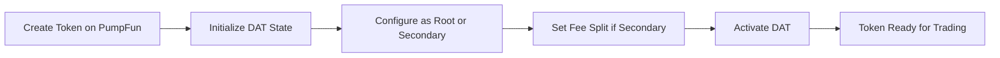

# ASDF DAT - Production Workflow

> **Complete operational workflow for the hierarchical token buyback-and-burn system**

## Table of Contents
1. [System Overview](#system-overview)
2. [Architecture Components](#architecture-components)
3. [Token Hierarchy](#token-hierarchy)
4. [Complete Workflow](#complete-workflow)
5. [Fee Flow & Distribution](#fee-flow--distribution)
6. [Operational Cycles](#operational-cycles)
7. [Monitoring & Maintenance](#monitoring--maintenance)
8. [Error Handling](#error-handling)
9. [Deployment Checklist](#deployment-checklist)
10. [Production Best Practices](#production-best-practices)

---

## System Overview

**ASDF DAT** is an automated buyback-and-burn system that:
- Collects trading fees from PumpFun tokens
- Uses fees to buy back tokens from the bonding curve
- Burns purchased tokens to create deflationary pressure
- Implements a hierarchical structure where secondary tokens redirect fees to a root token

### Key Innovation: Hierarchical Fee Redistribution

```
                    ┌─────────────┐
                    │  ROOT TOKEN │
                    │   (DATSPL)  │
                    └──────┬──────┘
                           │
         ┌─────────────────┼─────────────────┐
         │                 │                 │
    ┌────▼─────┐     ┌────▼─────┐     ┌────▼─────┐
    │SECONDARY1│     │SECONDARY2│     │SECONDARY3│
    │  (DATS2) │     │  (DATM)  │     │  (DATS)  │
    └──────────┘     └──────────┘     └──────────┘
         │                 │                 │
         │ 44.8% of fees   │ 44.8% of fees   │ 44.8% of fees
         └─────────────────┴─────────────────┘
                           │
                    Root Treasury
                    (accumulates)
```

**Fee Split for Secondary Tokens:**
- 44.8% → Root Treasury (benefits root token holders)
- 55.2% → Used for secondary token buyback

**Root Token:**
- 100% of fees → Used for root token buyback

---

## Architecture Components

### Smart Contract (Anchor/Rust)

**Program ID:** `ASDfNfUHwVGfrg3SV7SQYWhaVxnrCUZyWmMpWJAPu4MZ`

**Key Components:**

```rust
// Core State Accounts
pub struct DATState {
    pub admin: Pubkey,              // Admin authority
    pub dat_authority: Pubkey,      // PDA that holds fees
    pub dat_authority_bump: u8,     // Bump seed
    pub token_mint: Pubkey,         // Token being burned
    pub bonding_curve: Pubkey,      // PumpFun bonding curve
    pub is_active: bool,            // Kill switch
    pub root_token_mint: Option<Pubkey>,  // If secondary, root token
    pub fee_split_bps: u16,         // Basis points (4480 = 44.8%)
}

pub struct TokenStats {
    pub total_burned: u64,          // Total tokens burned
    pub total_sol_collected: u64,   // Total SOL collected
    pub total_sol_sent_to_root: u64,// Total sent to root (if secondary)
    pub cycle_count: u64,           // Number of cycles executed
}
```

**Core Instructions:**

1. **`initialize_dat_state`** - Setup DAT for a token
2. **`collect_fees`** - Collect fees from PumpFun creator vault
3. **`execute_buy`** - Buy tokens using collected fees (with fee split)
4. **`burn_and_update`** - Burn purchased tokens and update stats

### PumpFun Integration

**PumpFun Program:** `6EF8rrecthR5Dkzon8Nwu78hRvfCKubJ14M5uBEwF6P`

**Key Accounts:**
- **Creator Vault**: PDA where trading fees accumulate
- **Bonding Curve**: AMM curve for token pricing
- **Global Config**: PumpFun global parameters
- **Fee Recipients**: Protocol fee distribution accounts

### Off-Chain Automation (TypeScript/Node.js)

**Core Scripts:**
- `execute-cycle-root.ts` - Execute full cycle for root token
- `execute-cycle-secondary.ts` - Execute full cycle for secondary token
- `monitor.sh` - Continuous monitoring daemon

---

## Token Hierarchy

### Root Token (DATSPL)

**Characteristics:**
- No fee split (100% of fees used for buyback)
- Accumulates fees from all secondary tokens
- Maximum deflationary pressure
- Highest value accrual

**Configuration:**
```javascript
{
  isRoot: true,
  rootTokenMint: null,
  feeSplitBps: 0  // No split
}
```

### Secondary Tokens (DATS2, DATM, etc.)

**Characteristics:**
- 44.8% of fees redirected to root treasury
- 55.2% of fees used for own buyback
- Can be SPL or Token2022 (Mayhem Mode)
- Supports root token ecosystem

**Configuration:**
```javascript
{
  isRoot: false,
  rootTokenMint: "rxeo277TLJfPYX6zaSfbtyHWY7BkTREL9AidoNi38jr",
  feeSplitBps: 4480  // 44.8%
}
```

---

## Complete Workflow

### Phase 1: Token Launch



**Steps:**

1. **Token Creation** (via PumpFun)
   ```bash
   npx ts-node scripts/create-token-spl.ts
   # or
   npx ts-node scripts/create-token-mayhem.ts  # Token2022
   ```

2. **DAT Initialization**
   ```bash
   npx ts-node scripts/init-dat-state.ts
   npx ts-node scripts/init-token-stats.ts
   npx ts-node scripts/init-dat-token-account.ts
   ```

3. **Configuration**
   ```bash
   # For secondary token:
   npx ts-node scripts/set-root-token.ts <ROOT_MINT>
   npx ts-node scripts/update-fee-split.ts 4480  # 44.8%
   ```

### Phase 2: Trading & Fee Accumulation

```
User Trades → PumpFun AMM → Trading Fees (1%) → Creator Vault
                                                      ↓
                                              Fees Accumulate
                                              (passive process)
```

**Continuous Process:**
- Users buy/sell tokens on PumpFun
- 1% trading fee collected by PumpFun
- Fees accumulate in creator vault PDA
- No action required from DAT system

**Monitoring:**
```bash
# Check fee accumulation
npx ts-node scripts/check-creator-vault.ts

# Expected output:
# Creator Vault: 0.005728 SOL
# Status: ✅ Above minimum (0.0055 SOL) for secondary tokens
```

### Phase 3: Buyback Cycle Execution

**Root Token Cycle:**

```
┌─────────────────────────────────────────────────────┐
│  ROOT TOKEN CYCLE (100% fees for buyback)          │
└─────────────────────────────────────────────────────┘

STEP 1: Collect Fees
┌─────────────────────────────────────────────────────┐
│ Creator Vault → DAT Authority                       │
│ collect_fees(is_root_token = true)                  │
└─────────────────────────────────────────────────────┘
         ↓
    Available: 0.063727 SOL

STEP 2: Execute Buy
┌─────────────────────────────────────────────────────┐
│ Calculate buy amount (after rent reserves)          │
│ buy_amount = available - rent - buffer              │
│           = 63,727,000 - 890,880 - 50,000           │
│           = 62,786,120 lamports (0.0628 SOL)        │
│                                                      │
│ Call PumpFun buy instruction via CPI                │
│ execute_buy(is_secondary_token = false)             │
│                                                      │
│ Result: Buy ~8,325,400 tokens                       │
└─────────────────────────────────────────────────────┘
         ↓
    Tokens → DAT Token Account

STEP 3: Burn & Update
┌─────────────────────────────────────────────────────┐
│ Burn all purchased tokens                           │
│ burn_and_update()                                   │
│                                                      │
│ Update TokenStats:                                  │
│  - total_burned += 8,325,400                        │
│  - total_sol_collected += 0.063727                  │
│  - cycle_count += 1                                 │
└─────────────────────────────────────────────────────┘
         ↓
    ✅ Cycle Complete
    Circulating Supply Reduced
```

**Secondary Token Cycle:**

```
┌─────────────────────────────────────────────────────┐
│  SECONDARY TOKEN CYCLE (with fee split)            │
└─────────────────────────────────────────────────────┘

STEP 1: Collect Fees
┌─────────────────────────────────────────────────────┐
│ Creator Vault → DAT Authority                       │
│ collect_fees(is_root_token = false)                 │
└─────────────────────────────────────────────────────┘
         ↓
    Available: 0.006978 SOL

STEP 2: Execute Buy with Split
┌─────────────────────────────────────────────────────┐
│ Validate: available ≥ MIN_FEES_FOR_SPLIT (0.0055)  │
│ ✅ 6,978,000 ≥ 5,500,000 lamports                   │
│                                                      │
│ Calculate split:                                    │
│  - To root: 44.8% = 2,704,524 lamports              │
│  - Remaining: 55.2% = 3,382,596 lamports            │
│                                                      │
│ Transfer to root treasury:                          │
│   DAT Authority → Root Treasury (2,704,524)         │
│                                                      │
│ Calculate buy amount from remaining:                │
│   buy_amount = remaining - rent - buffer - ATA      │
│              = 3,382,596 - 890,880 - 50,000 - 2.1M  │
│              = 1,232,359 lamports (0.0012 SOL)      │
│                                                      │
│ Call PumpFun buy instruction via CPI                │
│   Result: Buy ~157,515 tokens                       │
└─────────────────────────────────────────────────────┘
         ↓
    Tokens → DAT Token Account
    SOL → Root Treasury

STEP 3: Burn & Update
┌─────────────────────────────────────────────────────┐
│ Burn all purchased tokens                           │
│ burn_and_update()                                   │
│                                                      │
│ Update TokenStats:                                  │
│  - total_burned += 157,515                          │
│  - total_sol_collected += 0.006978                  │
│  - total_sol_sent_to_root += 0.002705               │
│  - cycle_count += 1                                 │
└─────────────────────────────────────────────────────┘
         ↓
    ✅ Cycle Complete
    Secondary Supply Reduced
    Root Treasury Funded
```

---

## Fee Flow & Distribution

### Economic Model

**Per Trade Fees (PumpFun):**
```
User buys 1000 tokens with 0.1 SOL
├─ 0.099 SOL → Bonding Curve (token purchase)
└─ 0.001 SOL → Trading Fee (1%)
              └─ Creator Vault (accumulates)
```

**Root Token Fee Usage:**
```
Collected: 0.063727 SOL
├─ Rent Reserve: 0.000891 SOL (stay solvent)
├─ Safety Buffer: 0.000050 SOL (margin)
└─ Buy Amount: 0.062786 SOL → Buyback ~8.3M tokens
```

**Secondary Token Fee Split:**
```
Collected: 0.006978 SOL
├─ Rent Reserve: 0.000891 SOL
├─ Available: 0.006087 SOL
    ├─ To Root (44.8%): 0.002705 SOL → Root Treasury
    └─ For Buyback (55.2%): 0.003382 SOL
        ├─ Rent Reserve: 0.000891 SOL
        ├─ Safety Buffer: 0.000050 SOL
        ├─ ATA Reserve: 0.002100 SOL (fee recipient)
        └─ Buy Amount: 0.001232 SOL → Buyback ~157K tokens
```

### Fee Accumulation Timeline

**Example Scenario:**

```
Day 1: Trading Volume = 100 SOL
       ├─ Trading Fees = 1 SOL (1%)
       └─ Creator Vault = 1.000000 SOL

Day 2: Cycle Execution (Root Token)
       ├─ Collect: 1.000000 SOL
       ├─ Buy: ~13.3M tokens with 0.999 SOL
       ├─ Burn: 13.3M tokens
       └─ Circulating Supply: -13.3M tokens ↓

Day 3: Trading Volume = 150 SOL
       ├─ Trading Fees = 1.5 SOL
       └─ Creator Vault = 1.500000 SOL

Day 4: Cycle Execution (Secondary Token)
       ├─ Collect: 1.500000 SOL
       ├─ To Root: 0.672 SOL (44.8%)
       ├─ Buy Secondary: ~11M tokens with 0.828 SOL
       ├─ Burn Secondary: 11M tokens
       └─ Root Treasury Accumulated: 0.672 SOL

Day 5: Root Token Cycle (uses accumulated treasury)
       ├─ Root Treasury: 0.672 SOL (from secondary)
       ├─ Own Fees: 0.500 SOL
       ├─ Total Available: 1.172 SOL
       ├─ Buy: ~15.6M tokens
       └─ Root Supply Reduction: -15.6M tokens ↓
```

---

## Operational Cycles

### Manual Execution (Development/Testing)

```bash
# Root Token
npx ts-node scripts/execute-cycle-root.ts

# Secondary Token
npx ts-node scripts/execute-cycle-secondary.ts devnet-token-secondary.json

# Mayhem Token
npx ts-node scripts/execute-cycle-secondary.ts devnet-token-mayhem.json
```

### Automated Execution (Production)

**Option 1: Cron Job**

```bash
# /etc/crontab or crontab -e
# Execute cycles every 6 hours
0 */6 * * * cd /path/to/asdf-dat && npx ts-node scripts/execute-cycle-root.ts >> logs/root-cycles.log 2>&1
30 */6 * * * cd /path/to/asdf-dat && npx ts-node scripts/execute-cycle-secondary.ts devnet-token-secondary.json >> logs/secondary-cycles.log 2>&1
```

**Option 2: PM2 Process Manager**

```javascript
// ecosystem.config.js
module.exports = {
  apps: [
    {
      name: 'dat-root-cycles',
      script: 'scripts/execute-cycle-root.ts',
      interpreter: 'npx',
      interpreter_args: 'ts-node',
      cron_restart: '0 */6 * * *',  // Every 6 hours
      autorestart: false,
      watch: false,
      env: {
        NODE_ENV: 'production',
        SOLANA_RPC: 'https://api.mainnet-beta.solana.com'
      }
    },
    {
      name: 'dat-secondary-cycles',
      script: 'scripts/execute-cycle-secondary.ts',
      args: 'mainnet-token-secondary.json',
      interpreter: 'npx',
      interpreter_args: 'ts-node',
      cron_restart: '30 */6 * * *',  // Every 6 hours, offset 30min
      autorestart: false,
      watch: false,
      env: {
        NODE_ENV: 'production',
        SOLANA_RPC: 'https://api.mainnet-beta.solana.com'
      }
    }
  ]
};
```

```bash
# Start automation
pm2 start ecosystem.config.js

# Monitor
pm2 logs
pm2 monit

# Manage
pm2 stop dat-root-cycles
pm2 restart dat-secondary-cycles
pm2 delete all
```

**Option 3: Kubernetes CronJob**

```yaml
apiVersion: batch/v1
kind: CronJob
metadata:
  name: dat-root-cycle
spec:
  schedule: "0 */6 * * *"  # Every 6 hours
  jobTemplate:
    spec:
      template:
        spec:
          containers:
          - name: executor
            image: node:18-alpine
            command:
            - npx
            - ts-node
            - scripts/execute-cycle-root.ts
            volumeMounts:
            - name: wallet-secret
              mountPath: /app/wallet.json
              subPath: wallet.json
              readOnly: true
          volumes:
          - name: wallet-secret
            secret:
              secretName: solana-wallet
          restartPolicy: OnFailure
```

### Monitoring Script

```bash
#!/bin/bash
# scripts/monitor.sh

while true; do
    echo "═══════════════════════════════════════════════════════════"
    echo "🔍 DAT System Monitoring - $(date)"
    echo "═══════════════════════════════════════════════════════════"

    # Check creator vault balances
    echo ""
    echo "📊 Fee Accumulation:"
    npx ts-node scripts/check-creator-vault.ts

    # Check DAT state
    echo ""
    echo "⚙️  System Status:"
    npx ts-node scripts/check-dat-state.ts

    # Check if cycles are needed
    echo ""
    echo "🎯 Cycle Readiness:"
    vault_balance=$(npx ts-node -e "
        import { Connection, PublicKey } from '@solana/web3.js';
        const conn = new Connection('https://api.mainnet-beta.solana.com');
        const vault = new PublicKey('YOUR_CREATOR_VAULT');
        conn.getBalance(vault).then(b => console.log(b));
    ")

    if [ "$vault_balance" -gt 10000000 ]; then  # 0.01 SOL threshold
        echo "✅ Sufficient fees - executing cycle..."
        npx ts-node scripts/execute-cycle-root.ts
    else
        echo "⏳ Waiting for more fees ($vault_balance lamports)"
    fi

    # Sleep 1 hour
    sleep 3600
done
```

---

## Monitoring & Maintenance

### Key Metrics to Track

**On-Chain Metrics:**
```typescript
// Monitor via TokenStats account
interface Metrics {
  // Burn metrics
  totalBurned: number;           // Total tokens burned
  burnRate: number;              // Tokens/day

  // Fee metrics
  totalSolCollected: number;     // Total SOL collected
  collectionRate: number;        // SOL/day
  totalSolSentToRoot: number;    // If secondary

  // Cycle metrics
  cycleCount: number;            // Number of cycles
  lastCycleTimestamp: number;    // Unix timestamp
  averageCycleSize: number;      // Tokens/cycle

  // Supply metrics
  circulatingSupply: number;     // Current supply
  burnPercentage: number;        // % of total burned
  deflationRate: number;         // %/month
}
```

**Monitoring Dashboard:**
```bash
# Real-time monitoring
npx ts-node scripts/monitor-dashboard.ts

# Output:
╔════════════════════════════════════════════════════════════╗
║          ASDF DAT MONITORING DASHBOARD                     ║
╠════════════════════════════════════════════════════════════╣
║ Root Token (DATSPL)                                        ║
║  • Circulating Supply: 973,617,401 tokens                  ║
║  • Total Burned: 26,382,599 tokens (2.64%)                 ║
║  • Creator Vault: 0.063727 SOL                             ║
║  • Cycle Count: 3 cycles                                   ║
║  • Last Cycle: 2 hours ago                                 ║
║  • Status: ✅ Active                                        ║
╠════════════════════════════════════════════════════════════╣
║ Secondary Token (DATS2)                                    ║
║  • Circulating Supply: 990,617,701 tokens                  ║
║  • Total Burned: 9,382,299 tokens (0.94%)                  ║
║  • Creator Vault: 0.001496 SOL                             ║
║  • Sent to Root: 0.030860 SOL                              ║
║  • Cycle Count: 1 cycle                                    ║
║  • Status: ⚠️  Low fees                                     ║
╠════════════════════════════════════════════════════════════╣
║ Alerts                                                     ║
║  ⚠️  DATS2: Fees below minimum (0.0055 SOL)                ║
║  ✅ DATSPL: Ready for cycle execution                      ║
╚════════════════════════════════════════════════════════════╝
```

### Health Checks

```typescript
// scripts/health-check.ts
async function healthCheck() {
  const checks = {
    // 1. Program deployed and accessible
    programAccessible: await checkProgram(),

    // 2. DAT state valid
    datStateValid: await checkDATState(),

    // 3. DAT authority has rent exemption
    authorityRentExempt: await checkRentExemption(),

    // 4. Token accounts exist
    tokenAccountsExist: await checkTokenAccounts(),

    // 5. PumpFun bonding curve active
    bondingCurveActive: await checkBondingCurve(),

    // 6. Creator vault accessible
    vaultAccessible: await checkCreatorVault(),

    // 7. Root treasury funded (if secondary)
    rootTreasuryOk: await checkRootTreasury(),
  };

  return checks;
}
```

### Alert System

```typescript
// scripts/alert-system.ts
interface Alert {
  severity: 'info' | 'warning' | 'error' | 'critical';
  message: string;
  timestamp: number;
}

// Alert triggers
const ALERTS = {
  LOW_FEES: { threshold: 0.001, severity: 'warning' },
  VERY_LOW_FEES: { threshold: 0.0001, severity: 'error' },
  CYCLE_FAILED: { severity: 'critical' },
  STATE_INACTIVE: { severity: 'critical' },
  AUTHORITY_LOW_RENT: { threshold: 0.0005, severity: 'error' },
};

// Alert destinations
async function sendAlert(alert: Alert) {
  // Discord webhook
  await fetch(process.env.DISCORD_WEBHOOK, {
    method: 'POST',
    body: JSON.stringify({
      content: `**[${alert.severity.toUpperCase()}]** ${alert.message}`
    })
  });

  // Telegram
  await fetch(`https://api.telegram.org/bot${BOT_TOKEN}/sendMessage`, {
    method: 'POST',
    body: JSON.stringify({
      chat_id: CHAT_ID,
      text: `🚨 ${alert.message}`
    })
  });

  // Email (via SendGrid/AWS SES)
  await sendEmail({
    to: process.env.ADMIN_EMAIL,
    subject: `DAT Alert: ${alert.severity}`,
    body: alert.message
  });
}
```

---

## Error Handling

### Common Errors & Solutions

**1. InsufficientFees**
```
Error: Insufficient fees for secondary token cycle: 594997 < 5500000 lamports
Required: ~0.0055 SOL minimum (covers rent + ATA creation + split)

Solution:
- Wait for more trading volume
- Minimum 0.0055 SOL required for secondary tokens
- Root tokens can execute with less (>0.001 SOL)
```

**2. InsufficientFundsForRent**
```
Error: InsufficientFundsForRent {account_index: 6}

Cause: Trying to create fee recipient ATA without enough rent reserve

Solution:
- Phase 2 validations prevent this
- Increase MIN_FEES_FOR_SPLIT if still occurring
- Check ATA_RENT_RESERVE constant (currently 2.1M lamports)
```

**3. AccountBorrowFailed**
```
Error: AccountBorrowFailed in execute_buy

Cause: Bonding curve account borrowed multiple times in same instruction

Solution:
- Fixed in current version (copy data before CPI)
- Ensure using latest program version
```

**4. NoPendingBurn**
```
Error: NoPendingBurn

Cause: Calling burn_and_update when no tokens were purchased

Solution:
- Ensure execute_buy succeeded before burn
- Check pending_burn_amount > 0 in state
- Don't call burn if buy failed
```

**5. DATNotActive**
```
Error: DAT not active

Cause: is_active flag set to false in DATState

Solution:
- Admin needs to reactivate: set_active(true)
- Check why it was deactivated (emergency stop?)
```

### Graceful Degradation

```typescript
// Retry logic with exponential backoff
async function executeCycleWithRetry(maxRetries = 3) {
  for (let attempt = 1; attempt <= maxRetries; attempt++) {
    try {
      await executeCycle();
      return { success: true };
    } catch (error) {
      console.error(`Attempt ${attempt}/${maxRetries} failed:`, error);

      // Don't retry on certain errors
      if (error.message.includes('InsufficientFees')) {
        return { success: false, reason: 'insufficient_fees', retryable: false };
      }

      if (error.message.includes('DATNotActive')) {
        return { success: false, reason: 'dat_inactive', retryable: false };
      }

      // Exponential backoff
      if (attempt < maxRetries) {
        const delay = Math.pow(2, attempt) * 1000; // 2s, 4s, 8s
        await sleep(delay);
      }
    }
  }

  return { success: false, reason: 'max_retries_exceeded', retryable: true };
}
```

### Circuit Breaker Pattern

```typescript
class CircuitBreaker {
  private failures = 0;
  private lastFailure = 0;
  private state: 'closed' | 'open' | 'half-open' = 'closed';

  constructor(
    private threshold = 5,           // Failures before opening
    private timeout = 60000,         // 1 minute cooldown
    private halfOpenAttempts = 1     // Attempts in half-open
  ) {}

  async execute<T>(fn: () => Promise<T>): Promise<T> {
    if (this.state === 'open') {
      if (Date.now() - this.lastFailure > this.timeout) {
        this.state = 'half-open';
      } else {
        throw new Error('Circuit breaker is OPEN');
      }
    }

    try {
      const result = await fn();
      this.onSuccess();
      return result;
    } catch (error) {
      this.onFailure();
      throw error;
    }
  }

  private onSuccess() {
    this.failures = 0;
    this.state = 'closed';
  }

  private onFailure() {
    this.failures++;
    this.lastFailure = Date.now();

    if (this.failures >= this.threshold) {
      this.state = 'open';
      sendAlert({
        severity: 'critical',
        message: 'Circuit breaker OPENED - too many failures',
        timestamp: Date.now()
      });
    }
  }
}

// Usage
const breaker = new CircuitBreaker();
await breaker.execute(() => executeCycle());
```

---

## Deployment Checklist

### Pre-Deployment

**1. Smart Contract Audit**
- [ ] Security audit completed
- [ ] Known vulnerabilities patched
- [ ] Access control verified
- [ ] Upgradability reviewed

**2. Infrastructure Setup**
- [ ] RPC endpoint configured (Helius/QuickNode/Triton)
- [ ] Backup RPC endpoints ready
- [ ] Wallet secured (Hardware wallet + secure key management)
- [ ] Monitoring infrastructure deployed

**3. Testing**
- [ ] Devnet testing completed
- [ ] Mainnet-fork testing done
- [ ] Load testing performed
- [ ] Emergency procedures tested

### Deployment Steps

```bash
# 1. Build program
anchor build

# 2. Deploy to mainnet
anchor deploy --provider.cluster mainnet

# 3. Verify deployment
solana program show <PROGRAM_ID> --url mainnet

# 4. Initialize DAT state for each token
npx ts-node scripts/init-dat-state.ts --network mainnet

# 5. Configure token hierarchy
npx ts-node scripts/set-root-token.ts --network mainnet

# 6. Activate DAT
npx ts-node scripts/set-active.ts true --network mainnet

# 7. Start monitoring
pm2 start ecosystem.config.js
pm2 save

# 8. Verify first cycle
npx ts-node scripts/execute-cycle-root.ts --network mainnet --dry-run
```

### Post-Deployment

**1. Monitoring Active**
- [ ] Dashboard accessible
- [ ] Alerts configured
- [ ] Logs being collected
- [ ] Metrics being tracked

**2. Documentation Updated**
- [ ] Mainnet addresses documented
- [ ] Runbook created
- [ ] Team trained
- [ ] Users informed

**3. Emergency Procedures Ready**
- [ ] Emergency contacts list
- [ ] Pause mechanism tested
- [ ] Recovery procedures documented
- [ ] Backup systems verified

---

## Production Best Practices

### Security

**1. Key Management**
```bash
# Use hardware wallet for admin operations
solana config set --keypair usb://ledger

# For automation, use dedicated keypair with minimal permissions
# Store in secure vault (AWS Secrets Manager, HashiCorp Vault)

# Never commit private keys
# Use environment variables
export WALLET_PRIVATE_KEY=$(aws secretsmanager get-secret-value --secret-id dat-wallet --query SecretString --output text)
```

**2. Access Control**
```rust
// Multiple admin roles
pub struct DATState {
    pub admin: Pubkey,              // Can do everything
    pub operator: Pubkey,           // Can execute cycles only
    pub emergency_admin: Pubkey,    // Can pause only
}

// Implement role-based checks
require!(ctx.accounts.signer.key() == state.admin ||
         ctx.accounts.signer.key() == state.operator,
         ErrorCode::Unauthorized);
```

**3. Rate Limiting**
```typescript
// Prevent abuse
const RATE_LIMITS = {
  cycles_per_hour: 10,
  cycles_per_day: 100,
  min_time_between_cycles: 300000,  // 5 minutes
};

let lastCycleTime = 0;
async function executeCycleRateLimited() {
  const now = Date.now();
  if (now - lastCycleTime < RATE_LIMITS.min_time_between_cycles) {
    throw new Error('Rate limit: too soon since last cycle');
  }

  await executeCycle();
  lastCycleTime = now;
}
```

### Performance Optimization

**1. RPC Optimization**
```typescript
// Use premium RPC with higher rate limits
const connection = new Connection(
  process.env.HELIUS_RPC_URL,
  {
    commitment: 'confirmed',
    confirmTransactionInitialTimeout: 60000,
  }
);

// Batch RPC calls
const [balance1, balance2, account1] = await Promise.all([
  connection.getBalance(pubkey1),
  connection.getBalance(pubkey2),
  connection.getAccountInfo(pubkey3),
]);

// Cache account data when possible
const cache = new Map<string, { data: any, timestamp: number }>();
const CACHE_TTL = 60000; // 1 minute
```

**2. Transaction Optimization**
```typescript
// Use recent blockhash caching
let cachedBlockhash: {
  blockhash: string;
  lastValidBlockHeight: number;
  timestamp: number;
} | null = null;

async function getRecentBlockhash() {
  if (cachedBlockhash &&
      Date.now() - cachedBlockhash.timestamp < 30000) {
    return cachedBlockhash;
  }

  const { blockhash, lastValidBlockHeight } =
    await connection.getLatestBlockhash();

  cachedBlockhash = { blockhash, lastValidBlockHeight, timestamp: Date.now() };
  return cachedBlockhash;
}

// Compute unit optimization
transaction.add(
  ComputeBudgetProgram.setComputeUnitLimit({ units: 200_000 }),
  ComputeBudgetProgram.setComputeUnitPrice({ microLamports: 1 })
);
```

### Cost Management

**1. Fee Estimation**
```typescript
// Estimate cycle costs
interface CostBreakdown {
  rpcCalls: number;           // RPC API calls
  transactionFees: number;    // Solana transaction fees
  computeUnits: number;       // Compute units used
  rentReserves: number;       // Rent for accounts
  total: number;
}

// Typical cycle cost
const CYCLE_COST = {
  rpcCalls: 10,                    // ~$0.000001 each
  transactionFees: 0.000005,       // SOL
  computeUnits: 200000,            // units
  total_usd: 0.001,               // ~$0.001 per cycle
};

// At current SOL price: ~$100
// Cost per cycle: ~$0.0005
// If 10 cycles/day: ~$0.005/day or $1.80/year
```

**2. Resource Monitoring**
```typescript
// Track RPC usage
let rpcCallCount = 0;
const originalFetch = connection._rpcRequest;
connection._rpcRequest = async (...args) => {
  rpcCallCount++;
  return originalFetch.apply(connection, args);
};

// Monthly report
setInterval(() => {
  console.log(`Monthly RPC calls: ${rpcCallCount}`);
  console.log(`Estimated cost: $${(rpcCallCount * 0.000001).toFixed(4)}`);
  rpcCallCount = 0;
}, 30 * 24 * 60 * 60 * 1000);
```

### Disaster Recovery

**1. Backup Procedures**
```bash
# Backup critical data daily
#!/bin/bash
DATE=$(date +%Y%m%d)

# Backup token configs
cp devnet-token-*.json backups/configs-$DATE/

# Backup wallet (encrypted)
gpg --encrypt --recipient admin@example.com wallet.json > backups/wallet-$DATE.json.gpg

# Backup state snapshots
npx ts-node scripts/snapshot-state.ts > backups/state-$DATE.json

# Upload to S3
aws s3 sync backups/ s3://dat-backups/
```

**2. Recovery Plan**
```markdown
## Disaster Recovery Procedure

### Scenario 1: Program Stopped Responding
1. Check RPC endpoint health
2. Check wallet balance (needs SOL for transactions)
3. Verify program is not paused (is_active flag)
4. Restart automation services
5. Execute test cycle manually

### Scenario 2: Data Corruption
1. Stop all automation
2. Query on-chain state
3. Compare with backups
4. If diverged, analyze discrepancy
5. Decide: continue or reinitialize

### Scenario 3: Exploit Detected
1. IMMEDIATELY pause program (emergency_stop)
2. Alert team
3. Analyze exploit
4. Deploy patch if possible
5. If not fixable: drain treasuries to secure address
6. Communicate to users

### Scenario 4: Lost Access
1. Use backup admin keypair
2. Transfer admin to recovered key
3. Update all systems with new key
4. Rotate all credentials
```

---

## Conclusion

The ASDF DAT system provides an automated, transparent, and efficient buyback-and-burn mechanism with innovative hierarchical fee redistribution. The production workflow is designed to be:

- **Automated**: Minimal manual intervention required
- **Secure**: Multi-layered security and access controls
- **Scalable**: Supports multiple tokens in hierarchy
- **Observable**: Comprehensive monitoring and alerting
- **Resilient**: Error handling and recovery procedures

For additional information:
- Technical Documentation: `/docs/`
- Setup Guides: `QUICK_START_DEVNET.md`, `PUMPFUN_DEVNET_GUIDE.md`
- API Reference: Anchor IDL at `target/idl/asdf_dat.json`

**Support**: Open an issue on GitHub or contact the development team.

---

**Version**: 1.0.0
**Last Updated**: 2025-11-24
**Deployed Program**: `ASDfNfUHwVGfrg3SV7SQYWhaVxnrCUZyWmMpWJAPu4MZ` (Devnet)
